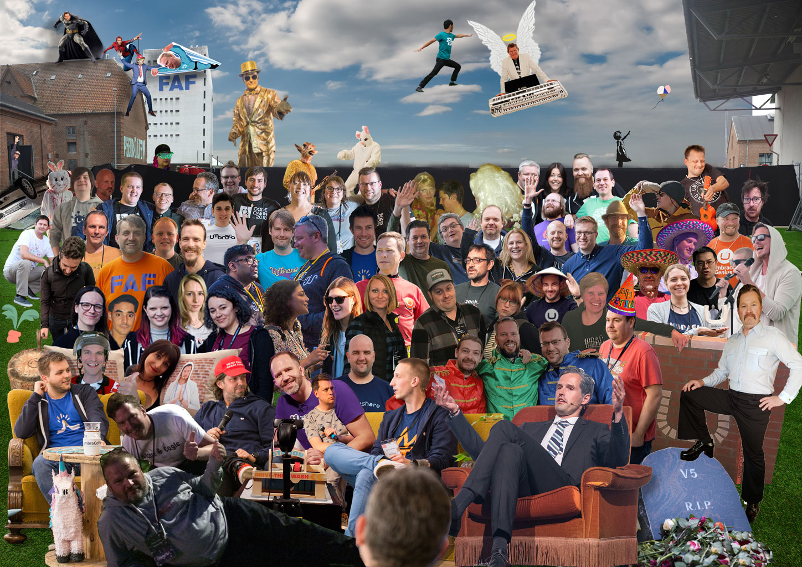

## CodeGarden 2020 Group image(s)

Since there is no CodeGarden for 2020, let's come together in a group picture anyway.  
[Sparked from this tweet...](https://twitter.com/marcemarc/status/1263566791281950734)

## Contribute

Make a PR to this repo and we'll see about merging you in.  
A pre-cut layer of yourself in psd or png would be sweet!

It would also be lovely to see joint talks you did or went to.

Depending on whether we stay with the one group photo or many,  
occational help expanding the garden would also be super appreciated!  
We have [extra foreground](./extra-foreground.jpg), and the main PSD
is split so the building to the right can be moved to the right.

Now go enjoy CG2020...

## Group photos

  
*Capturing the mood in the garden.*

## Talks

*Dave & Lars discussing where Dave's cheese went*
